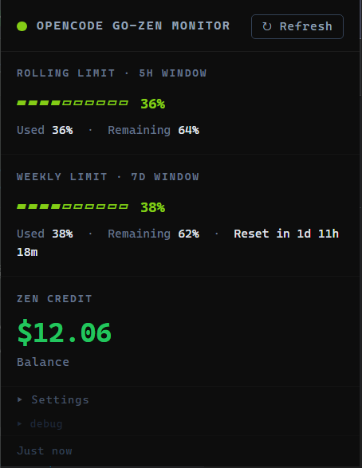

# opencode Go-Zen Usage Monitor

A clean, terminal-inspired Chrome extension that visualizes your **OpenCode Go plan usage** and **Zen credit balance** directly in the browser toolbar. No API keys, no extra logins — it just reads your existing session.



---

## Features

| Feature | Description |
|---------|-------------|
| **Toolbar Icon** | Circular progress icon showing how much of your rolling (5H) limit you've consumed. Color shifts in 20% steps from green (plenty left) to red (nearly exhausted). |
| **Badge Text** | Current Zen prepaid balance shown as a compact badge (e.g. `$12`, `$0.5`). |
| **Popup Dashboard** | Click the icon for a detailed breakdown: rolling 5H limit, weekly 7D limit with reset countdown, and Zen credit balance. All in a dark, TUI-inspired aesthetic. |
| **Auto-refresh** | Background Service Worker fetches fresh data at a configurable interval (default: every 30 minutes). |
| **Session Auth** | Uses your existing opencode.ai browser cookies. No manual login or token configuration required. **Your password is never visible to this extension.** |

### Color Key (Usage-Based)

The icon and progress bars change color based on **how much you've used**, not how much is left:

| Used % | Color | Meaning |
|--------|-------|---------|
| 0% – 20% | 🟢 Green | Plenty of headroom |
| 21% – 40% | 🟡 Lime | Still comfortable |
| 41% – 60% | 🟡 Yellow | Halfway there |
| 61% – 80% | 🟠 Orange | Getting tight |
| 81% – 100% | 🔴 Red | Running low |

---

## How It Works

OpenCode's dashboard is built with **SolidJS** and hydrates its state via inline `<script>` tags. This extension:

1. **Discovers your workspace URL** (best-effort auto-detection):
   - Checks `opencode.ai` cookies for your workspace ID
   - Follows the redirect from `https://opencode.ai/go` using your existing session
   - Falls back to reading the **current browser tab** when you click **"Detect from current tab"**
2. **Parses the hydration payload** (`_$HY` registry) from the `/go` page to extract:
   - `rollingUsage.usagePercent` → 5-hour rolling window
   - `weeklyUsage.usagePercent` + `resetInSec` → 7-day weekly window + countdown
   - `balance` → Zen credit (stored in 10⁻⁸ USD units)
3. **Caches all data** in `chrome.storage.local` and refreshes via `chrome.alarms`

> ⚠️ **Auto-detection is best-effort.** If it fails (e.g. cookies don't contain the workspace ID, or the redirect doesn't expose it), you can always paste your workspace URL manually in **▸ Settings**.

---

## Installation

### From Source (Developer Mode)

1. **Download the extension**
   ```bash
   git clone https://github.com/YOUR_USERNAME/opencode-usage-monitor.git
   cd opencode-usage-monitor
   ```
   Or download and extract the ZIP from GitHub.

2. **Open Chrome Extensions page**
   - Navigate to `chrome://extensions/`
   - Toggle **Developer mode** (top-right corner) to **ON**

3. **Load the extension**
   - Click **Load unpacked**
   - Select the `opencode-usage-monitor` folder (the one containing `manifest.json`)
   - The extension icon will appear in your toolbar

4. **Log in to OpenCode**
   - Make sure you are logged into [opencode.ai](https://opencode.ai) in the same browser profile
   - The extension uses your existing session cookies — no extra setup needed
   - If you see a **"Log in to OpenCode"** button in the popup, click it to open the login page

5. **Pin the icon** (optional but recommended)
   - Click the puzzle-piece icon in the Chrome toolbar
   - Click the pin icon next to **opencode Go-Zen Usage Monitor**

### Workspace URL (Auto-detected)

The extension tries three methods to find your workspace URL automatically:

1. **Cookies** — reads `opencode.ai` cookies for your workspace ID
2. **Redirects** — follows the redirect from `https://opencode.ai/go`
3. **Current tab** — click **"Detect from current tab"** in the popup while viewing your workspace Go page

> ⚠️ **Auto-detection is best-effort.** Even if you are logged in, the workspace ID may not be present in cookies or redirects. If the popup shows a login prompt, use the **"Detect from current tab"** button while you have your workspace Go page open, or paste the URL manually in **▸ Settings**.

If all methods fail, you can set it manually:

1. Open the extension popup
2. Click **▸ Settings**
3. Paste your workspace URL (e.g. `https://opencode.ai/workspace/wrk_xxxxxxxx/go`) into the **Workspace URL** field

You can find your workspace URL by:
- Logging into opencode.ai
- Navigating to the **Go** tab
- Copying the URL from your browser address bar

### Updating

To update after pulling new changes:

1. Go to `chrome://extensions/`
2. Find **opencode Go-Zen Usage Monitor**
3. Click the **reload (↻)** icon, **or** click **Remove** and repeat the Load unpacked step above

---

## Project Structure

```
opencode-usage-monitor/
├── manifest.json      # Extension manifest (Manifest V3)
├── background.js      # Service Worker — fetch, parse, cache, update icon/badge
├── popup.html         # Terminal-styled popup UI
├── popup.js           # Popup renderer and settings handler
├── docs/
│   └── screenshot.png # UI screenshot for README
└── README.md          # This file
```

---

## Permissions

| Permission | Why |
|------------|-----|
| `storage` | Cache usage data locally |
| `alarms`  | Schedule periodic background refreshes |
| `cookies` | Read `opencode.ai` cookies to auto-detect your workspace ID |
| `activeTab` | Read the current tab URL when you click **"Detect from current tab"** |
| `host_permissions: https://opencode.ai/*` | Fetch the `/go` page using your existing session cookies |

No external servers are contacted. All data stays on your machine.

---

## Privacy & Security

- **No password access**: This extension **cannot** see your OpenCode password, email, or any login credentials. It only reads the **session cookies** that your browser already has after you log in.
- **No data sent externally**: All network requests go directly to `opencode.ai`. Nothing is sent to third-party servers.
- **Local-only storage**: Usage data is cached only in your browser's `chrome.storage.local`.
- **Cookie requirement**: You must have **cookies enabled** for `opencode.ai`. If you block third-party cookies or use aggressive privacy modes that clear cookies, the extension will not be able to authenticate and will show a login prompt.

---

## Configuration

Click the **▸ Settings** panel inside the popup to change the auto-refresh interval:

- **1 min** — useful while developing or debugging
- **5 / 15 / 30 / 60 min** — standard intervals for daily use

The setting is persisted in `chrome.storage.local`.

---

## Browser Compatibility

Built for **Manifest V3** and tested on:

- Google Chrome (latest stable)
- Microsoft Edge (Chromium-based)
- Any Chromium-based browser supporting MV3 extensions

Firefox is **not supported** out of the box due to MV3 Service Worker and API differences.

---

## Disclaimer

This extension is an **unofficial, community-made tool**. It reverse-engineers the OpenCode dashboard's HTML/SolidJS hydration payload to extract usage data. While we do our best to keep calculations accurate, **we are not responsible for any discrepancies** between this extension's figures and the official OpenCode billing dashboard. Use at your own risk.

---

## License

MIT License — feel free to fork, modify, and share.

---

*Not affiliated with OpenCode or Anomaly. This is an independent, open-source utility created by the community.*
